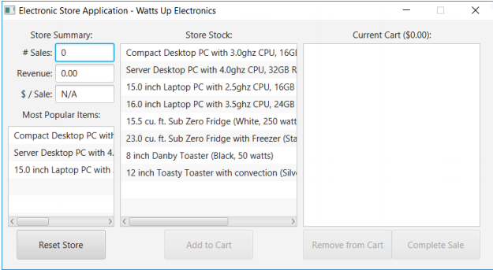
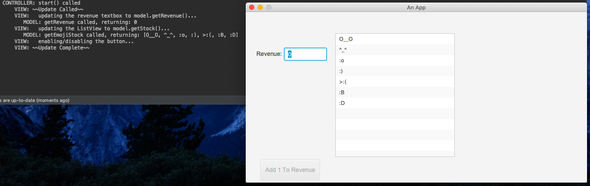
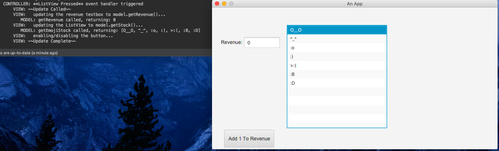
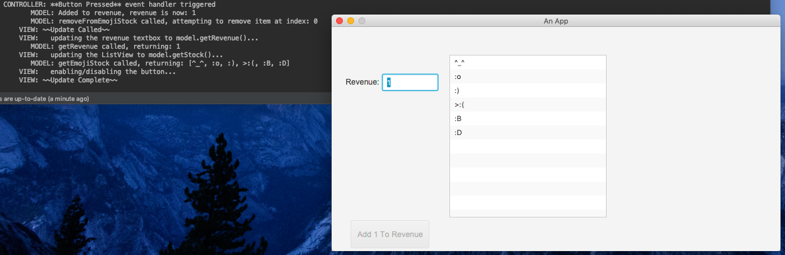

# Project Name
MVC Demo
## Purpose
As a teaching assistant for Introduction to Computer Science II (COMP 1406) at Carleton University, I held assignment workshops. Students often struggled with the JavaFX Graphical User Interface portion of the course, as this was often the very first assignment they had to complete where they weren't dealing with terminal-based programs. When I was in their position, I found the Model-View-Controller architectural pattern to be very helpful in terms of understanding how the pieces fit together in a GUI and how to approach coming up with a complete working solution. With that in mind, I wanted to design a very basic MVC app, modeled after their assignment, that students could see and play around with to hopefully get a better understanding of GUIs in general and a better sense of how to approach the assignment and come up with a working solution.

I posted this on the course website for students to download and included terminal printouts in my code. I included printouts so that it would be much easier and simpler for students to trace through the code and see how each part of the MVC paradigm interacted with and affected the others as they interacted with the application.
## Screenshots
### Assignment screenshot
- Expected appearance of assignment:

### MVC Demo screenshots (with terminal outputs indicating control flow)
- Upon starting:

- Clicking within the ListView:

- Clicking on the button, which added to the Revenue and updated it to +=1 :
 
